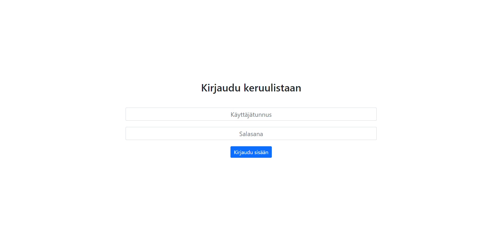
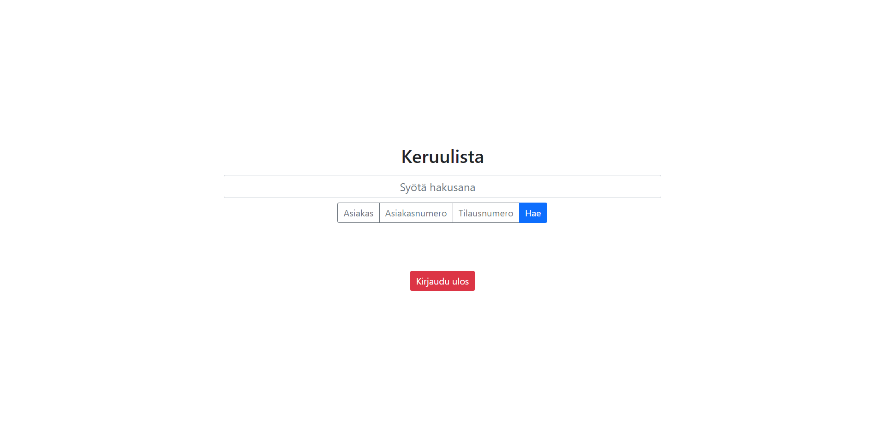
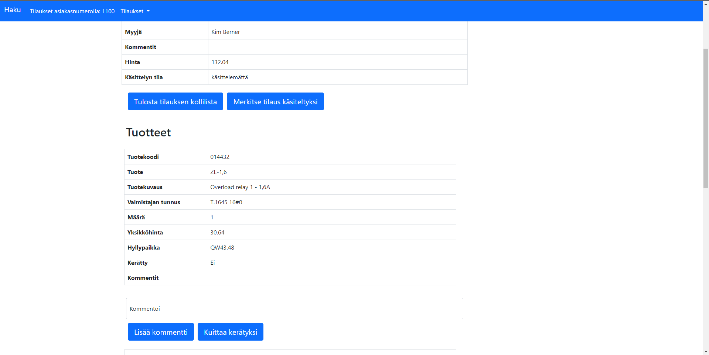

# Keruulista

Keruulista project for VAMK Johdatus ohjelmointiin course.

## Installation

Just download the files and place them into a folder of a web-server.

Can also be ran locally, no external programs required (Apart from a web browser with javascript enabled, uses bootstrap so you will need internet connection).

## Screenshots

Login page:

Search page:

Order viewing page:

## To-Do
(These are the things I would do if I ever come back to this project, not that likely though. No new functionality planned.)
- Try to use bootstrap only -> getting rid of style.css
- Try to compress js as much as possible, combine and compress functions (if possible).
- Try to find a more elegant way of showing the error message in search
